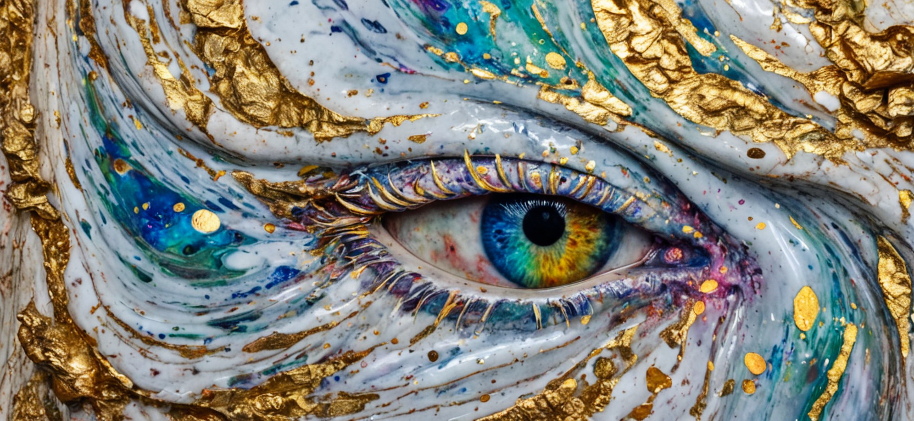
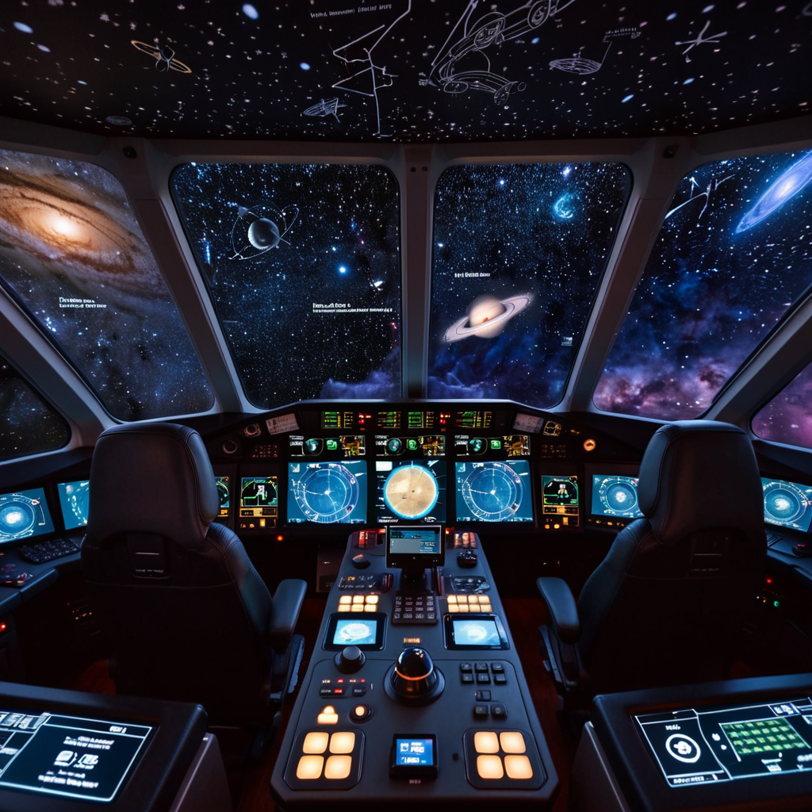
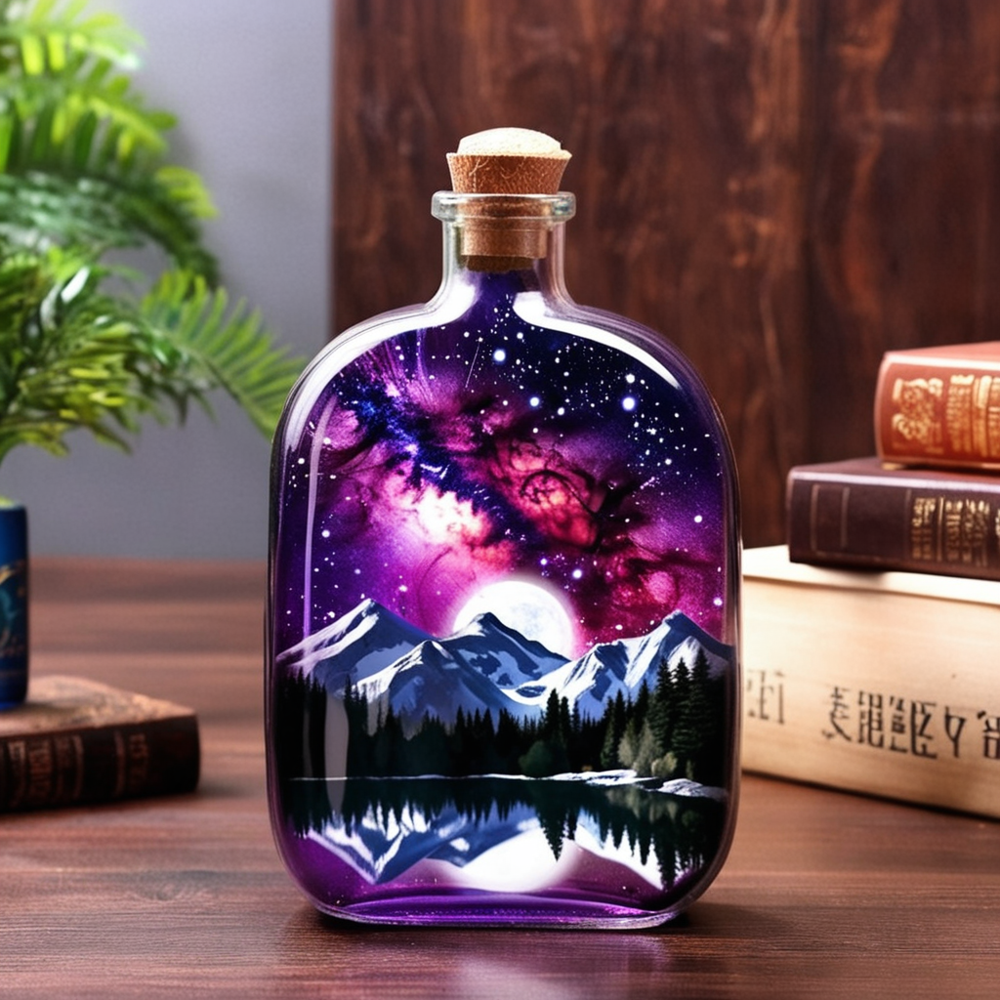

# Workflows

## 10 steps

### SD 1.5

### SDXL Warp Drive

## 12 Steps

### SDXL

## I don't know what this one is

## Attention Modifiers

## Dat Random Gurl

## Go-to Settings

## Potato Attention Guidance

## Simple SD Upscale

## Start by this one

## Others

